<p align="center">
  
</p>

<h1 align="center">MikroDash</h1>

<p align="center">
  <strong>Open-source command center for RouterOS</strong><br>
  Self-hosted and live over the MikroTik RouterOS v7 binary API: a single static binary, one Docker volume.
</p>

<p align="center">
  <a href="https://github.com/SecOps-7/MikroDash/releases/latest"></a>
  <a href="https://github.com/SecOps-7/MikroDash/pkgs/container/mikrodash"></a>
  
  
  <a href="LICENSE"></a>
</p>

<p align="center">
  <a href="#-quick-start">Quick start</a> ·
  <a href="#-features">Features</a> ·
  <a href="#-screenshots">Screenshots</a> ·
  <a href="#-routeros-setup">RouterOS setup</a> ·
  <a href="#-configuration">Configuration</a> ·
  <a href="#-security">Security</a> ·
  <a href="#-development">Development</a>
</p>

<p align="center">
  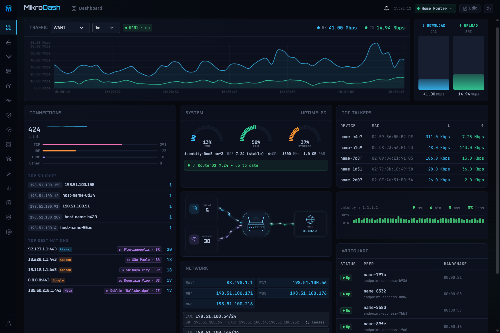
</p>

---

## ✨ Why MikroDash

- **Live, not refreshed.** MikroDash holds one connection per router and pushes changes to the browser over a WebSocket the moment they happen.
- **Kind to small routers.** Each RouterOS menu is read once however many pages want it, collectors sleep when nobody is looking, and every router can be switched between streaming and polling.
- **One binary, one volume.** A Go server with the TypeScript frontend built in, shipped as a multi-arch image. No database server, no agents on the router, no CDN: every asset is self-hosted, so it works on an isolated network.
- **Safe by design.** Credentials are encrypted at rest, every write is permission-checked and audited, and changes that could cut the dashboard off from the router are refused or warned about first.

---

## 🚀 Quick start

```yaml
# docker-compose.yml
services:
  mikrodash:
    image: ghcr.io/secops-7/mikrodash:latest
    restart: unless-stopped
    ports:
      - "3081:3081"
      - "13231:13231/udp"   # only for zero-touch provisioning; see below
    volumes:
      - mikrodash-data:/data

volumes:
  mikrodash-data:
```

```bash
docker compose up -d
```

Open **http://localhost:3081**. On first run MikroDash asks you to create an administrator account, then walks you through adding your first router and testing the connection. No `.env` file is needed.

> [!TIP]
> Images are published for `linux/amd64`, `linux/arm64` and `linux/arm/v7` on every release tag, so `latest` always means the latest release, never unreleased work. Pin a version with `ghcr.io/secops-7/mikrodash:<version>`.

<details>
<summary><strong>Run it on the router itself (RouterOS container)</strong></summary>

<br>

MikroDash can run on the MikroTik it monitors, using RouterOS's own container support:

```routeros
/container/add remote-image=ghcr.io/secops-7/mikrodash:latest \
  interface=veth_mikrodash root-dir=usb1/mikrodash \
  mountlists=mikrodash_data start-on-boot=yes comment="MikroDash"
```

Follow [`docs/routeros-container-install.md`](docs/routeros-container-install.md) for the full walkthrough: enabling container mode, the veth and bridge, the `input` chain firewall rule (its absence is the usual cause of a bare "timed out" when adding the router) and the `/data` mount, without which every repull discards your database.

The RouterOS **Apps** menu installs MikroDash from MikroTik's own copy of the catalogue, which they refresh on their own schedule and which can lag behind the current release. Adding it as an ordinary container, as above, always pulls the latest release.

</details>

<details>
<summary><strong>Build from source</strong></summary>

<br>

Only Docker is needed on the host:

```bash
git clone https://github.com/SecOps-7/MikroDash.git
cd MikroDash
docker build -t mikrodash:local .
docker run -d --name mikrodash --restart unless-stopped \
  -p 3081:3081 -v mikrodash-data:/data mikrodash:local
```

The multi-stage build bundles the frontend with esbuild through its Go API (`cmd/webbuild`, so no Node runtime is involved), compiles a static Go binary with `CGO_ENABLED=0`, and copies both into an Alpine runtime with `/data` as its only mount. For a multi-arch build:

```bash
docker buildx build --platform linux/amd64,linux/arm64,linux/arm/v7 -t mikrodash:local --load .
```

A worked deployment on a separate Docker host is in [`docs/deploy-r5s.md`](docs/deploy-r5s.md).

</details>

---

## 🧭 Features

### At a glance

| | |
|---|---|
| 📊 **Dashboard** | A drag-and-drop grid of cards (traffic, system health, network topology, connections, top talkers, WireGuard, and optional cards such as a world connections map, BGP peers, NetWatch, logs, a Security Score, and API diagnostics that show every router command by who asked for it). Layouts are saved to your account, so every browser shows the same arrangement. |
| 🛰️ **Multi-router fleet** | Manage many routers from one install. Switch from the header with no reload; the **Devices** page shows the whole fleet as cards, a sortable list or a world map, filterable by site. |
| 🔐 **Users and access control** | Per-user accounts with editable roles (a read and write matrix per page), granted to users or groups over everything, a site, or a single router. |
| 🔔 **Alerts and notifications** | Interface up/down, WireGuard peers, CPU, ping loss, NetWatch hosts, router online/offline, RouterOS updates, configuration drift and backup failures, delivered to Telegram, Pushbullet, ntfy and email, with cooldowns and editable templates. |
| 📈 **History and reports** | Traffic, ping, bandwidth, alerts and connectivity recorded to SQLite, viewable by date range, exported to CSV or PDF, and emailed on a daily, weekly or monthly schedule. Click any interface for its own traffic: live for the last minute, or up to thirty days back for the interfaces you choose to record. |
| 🪄 **Zero-touch provisioning** | Add a router before it exists: a wizard makes a short script for it, and when the router runs it, it calls home, joins the fleet and receives its Config Management template on its own. Remote routers dial in over a WireGuard tunnel built into MikroDash, from behind NAT anywhere; a generic script brings in a whole rollout, each router waiting for your approval. |
| 🧩 **Config Management** | A library of 20 ready-made configuration templates (firewalls, VLANs, a guest network, WireGuard, DNS, queues, monitoring) plus your own, captured from a router or written in the editor. Every setting has a working default. Deploy to one router or the fleet: a syntax check first, a restore point, a canary router before the rest, an automatic revert if a change cuts MikroDash off, and History and Drift afterwards. |
| 💾 **Backups** | Scheduled configuration backups kept only when something changed, with a unified diff of what moved, retention rules, and a guarded restore. |
| 🛠️ **Tools** | Ping, traceroute with an animated world map of the hops, torch and bandwidth test, run from the router with live output and a Stop button. |
| 🛡️ **Security Scan** | Audits the router's configuration (management access, firewall, exposed services, accounts, system, wireless and certificates), scores it, and links each finding to the page where it is fixed. The score is also a Dashboard card, and the AI Agent can run the scan when you ask how secure a router is. |
| 🤖 **AI Agent** | An optional assistant that answers questions from live router data and makes changes through the same checks, audit trail and undo as the forms: one row, or several as a plan you approve once. It can reboot, upgrade, sign a certificate, set the clock, run a script, read a file or an export, and undo its own change, always with your confirmation. Works with any OpenAI-compatible endpoint, including local models. |
| 📦 **Containers** | RouterOS containers with their env lists, mounts and interfaces, plus an **Apps** tab that browses RouterOS's app store and installs an app in one click. |
| 🧾 **Audit trail** | Every write, allowed or refused, with who, where, what changed and the outcome. Filterable and exportable to CSV. Credential values are never stored. |
| 🎨 **Make it yours** | 26 colour palettes, 26 self-hosted fonts, contrast and brightness controls, visible-page presets, a grouped sidebar, and custom branding (name and icon). |

### Pages

MikroDash has more than fifty pages. Here they are by area (the sidebar can group them too, or you can hide the ones you do not use). Most read live data; with write access, the configuration pages edit the router directly.

| Area | Pages |
|---|---|
| **Overview** | Dashboard, Devices, Config Management, Network Topology, WAN |
| **Wireless** | Wifi Networks, Wifi Clients, Wifi Map (draw your site and see clients around each access point), CAPsMAN (both the `wifi` and legacy stacks) |
| **Network** | Interfaces, IP Addresses, VLANs, Bridges, DHCP, DHCP Servers, DHCP Clients, DNS, IP Pools, Interface Lists, ARP |
| **Routing** | Routing (routes and BGP), Routing Tables, Routing Rules, OSPF, VRRP |
| **Tunnels** | VPN (an overview of every tunnel technology, with a card per live connection), WireGuard (interfaces and peers, with a client configuration and a scannable QR code), PPP, IPsec, OpenVPN, PPPoE Clients |
| **Traffic** | Connections (a world map, or a list of every connection), Bandwidth, Queues, Logs |
| **Security** | Firewall (Filter, NAT, Mangle and Raw, with reorder, undo and redo), Address Lists, Certificates, Security Scan |
| **System** | Users (RouterOS accounts and groups), Services, Packages, Scripts, Scheduler, NTP Client, Clock, Logging, SNMP, Files, Containers, NetWatch |
| **MikroDash** | Tools, AI Agent, Reports, Backups, Audit Trail, Settings |

Every table sorts by its headers, except the ones where order is meaning (firewall rules, queues, routing rules, IPsec policies): those always show the router's order, with move arrows.

<details>
<summary><strong>How writes are kept safe</strong></summary>

<br>

- **Lockout guards.** Changing or removing the address, interface, service, route, firewall rule, certificate or account MikroDash itself connects through is refused or raises a warning first, because nothing in the app could undo it.
- **Secrets are never read back.** WiFi passphrases, PPP and OpenVPN passwords, IPsec pre-shared keys and SNMP passwords are not requested from the router at all, so no page can display one. A blank password field means "keep the current one".
- **One deliberate exception, and it is audited.** A WireGuard peer's client configuration contains that peer's private key, which is the point of it. It is fetched by a one-shot request rather than carried on the socket, needs write access to the WireGuard page on that router, is refused outright when sign-in is off or no audit database exists, and writes a row naming who revealed it before the router is asked. The key itself never enters that row.
- **Code is for global administrators.** What a script, scheduler task, VRRP script or container image runs is RouterOS code, so changing it needs a global administrator.
- **Reboots ask for the router's name.** Rebooting, applying package changes, upgrading RouterOS or restoring a backup requires the router's name typed back.
- **Files that would act are refused.** A file created or downloaded to the router may not be named to run on arrival (`*.auto.*`) or to install at the next reboot (`.npk`). A file's contents are read only when you ask, capped, with credential values hidden.
- **Config Management deploys carefully.** A syntax check before anything runs, a restore point per router, a canary router whose name you type before the rest, an automatic revert if a change cuts MikroDash off, and a fresh login to prove it did not.
- **No sign-in, no writes.** With sign-in turned off, every configuration page is read-only.

</details>

<details>
<summary><strong>The AI Agent in detail</strong></summary>

<br>

**Off by default.** Nothing is sent anywhere until you switch it on and configure an endpoint.

- **Any OpenAI-compatible endpoint:** a hosted provider, a gateway, or a model on your own hardware (Ollama, LM Studio, vLLM, LiteLLM). Configure it under Settings, AI Agent, and use **Test Connection**; an endpoint with a self-signed certificate is trusted by pinning it from there, never by turning checking off. A hosted endpoint receives router names, addresses and network shape; a local one sends nothing outside your network.
- **Reads what you can read.** It answers from the router's current data and can look up any table your role permits, never a page your role denies.
- **Changes go through the forms' own path:** one row at a time, or several as a plan you approve once, with the same permission checks, lockout guards, undo history and audit entry. It can undo its own most recent change, and run the pages' own actions (reboot, upgrade, sign a certificate, run a script, download a file), each confirmed.
- **Only the router you selected.** It reads the others' status from MikroDash's records and cannot reach them. It reads files and configuration exports with credentials hidden, and a WireGuard client configuration opens in your browser, never in the conversation.
- **Raw RouterOS commands are off** unless a global administrator switches them on (Settings, AI Agent). Even then they are offered only to global administrators, and every command, reads included, runs only when you type the router's name.
- **Asks before changing anything** by default. Deletes, and changes that could cut MikroDash off from the router, always ask.
- **Keeps the conversation** per user and per router, so follow-up questions work. **Clear** deletes it, and it expires after the retention period you set.
- **Agent Overview card:** an optional dashboard card with a one-line router status written by the assistant.

[`docs/mikromcp-parity.md`](docs/mikromcp-parity.md) maps what the assistant can reach.

</details>

<details>
<summary><strong>Zero-touch provisioning in detail</strong></summary>

<br>

**Off by default.** Switch it on under Settings, Provisioning, and give the public name or address routers will dial.

- **Add device** on the Devices page asks where the router will be. **Remote** routers dial this MikroDash over WireGuard, so they can be anywhere with internet access; **Local** routers call home over your LAN and need no tunnel. Name it, optionally give its serial number (only that router can then use the script), pick its sites and a template, and download the script.
- **Run the script on the router**: upload it and run `/import`, or paste it into a terminal. It sets up the tunnel and an API user limited to MikroDash's address, then calls home every minute until MikroDash answers, and removes itself.
- **On arrival** the router is added to the fleet and its template is previewed on it and deployed through Config Management, with a restore point and the auto-revert, as the person who added it.
- **A generic script** (Settings, Provisioning) serves a whole rollout. Each router that runs it waits on the Devices page as **Not yet provisioned**, with its serial, model and RouterOS version, until you **Onboard** it (name, sites, template) or **Reject** it. Nothing connects to it before then.
- **Only your instance.** Every script carries this MikroDash's WireGuard key and instance ID. Scripts are shown once and expire; making a new one stops the old one working. The router's API password is made on the router (remote) and sent only inside the tunnel.
- **One UDP port**, 13231 by default, must be published and forwarded to MikroDash. The WireGuard server runs in userspace, so the container needs no extra privileges.

</details>

<details>
<summary><strong>Keyboard shortcuts</strong></summary>

<br>

| Key | Opens |
|---|---|
| `1` | Dashboard |
| `2` | WAN |
| `3` | Wifi Networks |
| `4` | Wifi Clients |
| `5` | CAPsMAN |
| `6` | Interfaces |
| `7` | DHCP |
| `8` | DNS |
| `9` | VLANs |
| `/` | Logs, with the search box focused |

</details>

---

## 📸 Screenshots

<table>
  <tr>
    <td width="50%">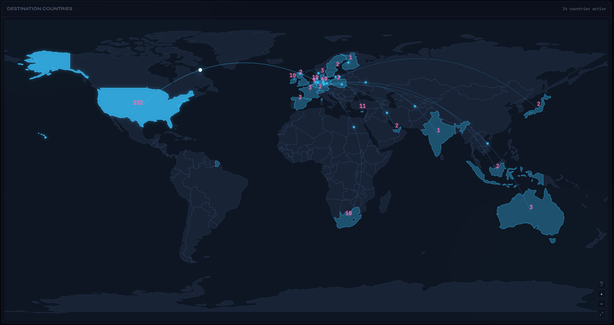<p align="center"><sub>Connections map</sub></p></td>
    <td width="50%">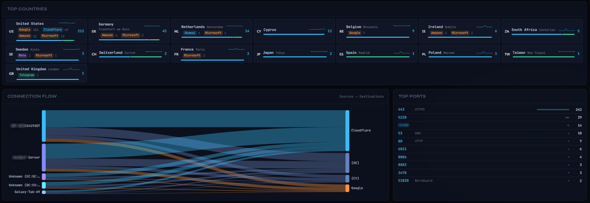<p align="center"><sub>Connections</sub></p></td>
  </tr>
  <tr>
    <td>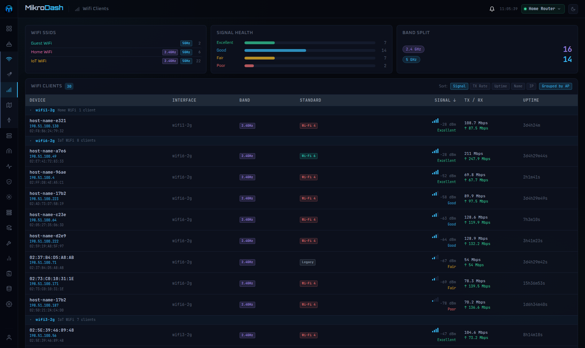<p align="center"><sub>Wifi clients</sub></p></td>
    <td>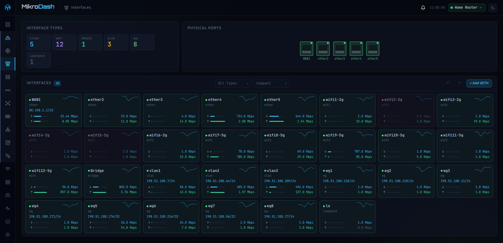<p align="center"><sub>Interfaces</sub></p></td>
  </tr>
  <tr>
    <td>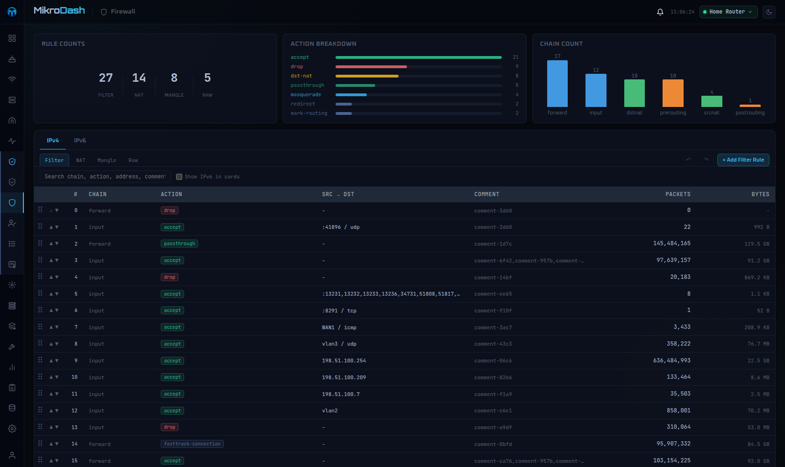<p align="center"><sub>Firewall</sub></p></td>
    <td>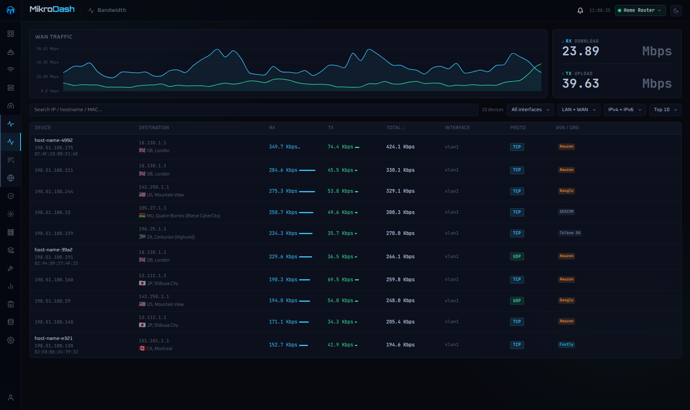<p align="center"><sub>Bandwidth</sub></p></td>
  </tr>
  <tr>
    <td>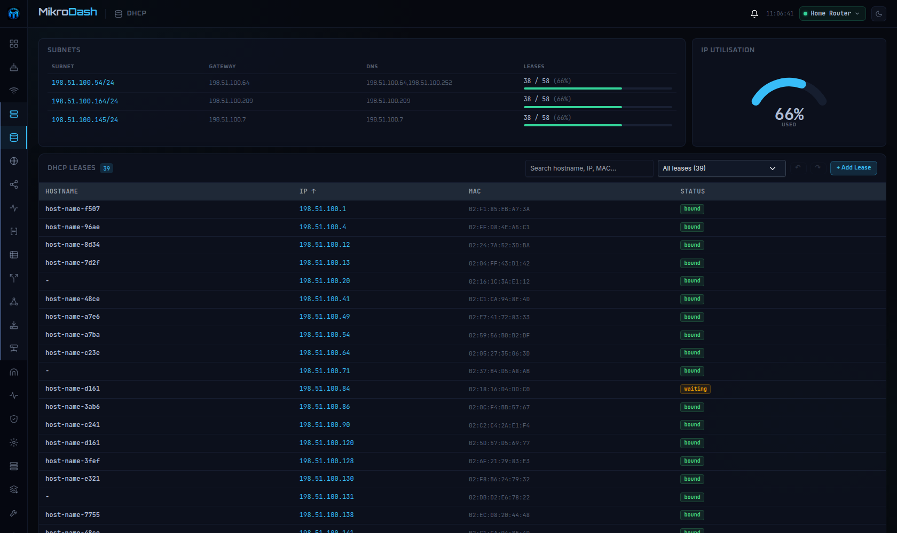<p align="center"><sub>DHCP</sub></p></td>
    <td>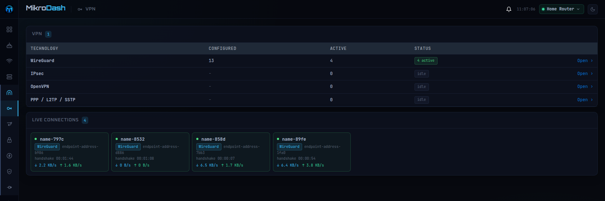<p align="center"><sub>VPN and WireGuard</sub></p></td>
  </tr>
  <tr>
    <td>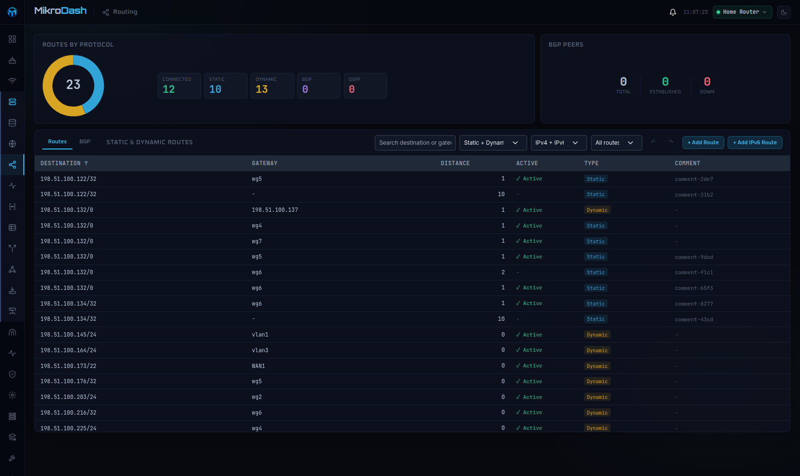<p align="center"><sub>Routing</sub></p></td>
    <td>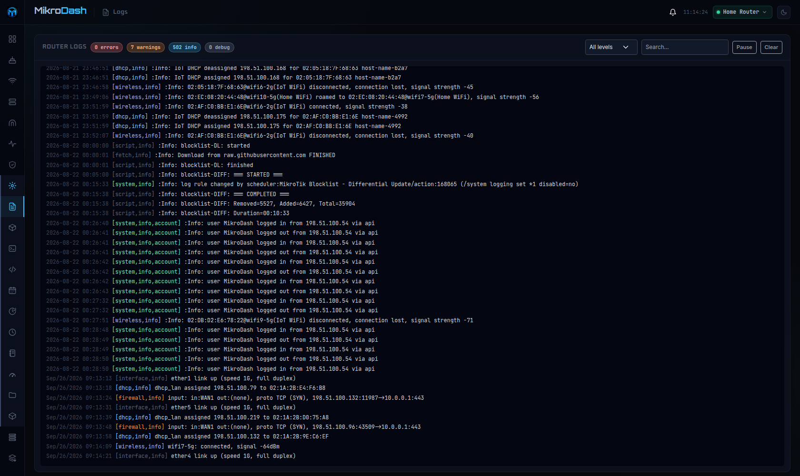<p align="center"><sub>Logs</sub></p></td>
  </tr>
</table>

---

## 🔌 RouterOS setup

Create a dedicated, **read-only** API user. Every page, chart and alert works with it, and a compromised dashboard cannot change your router:

```routeros
/ip service set api port=8728 disabled=no
/user group add name=mikrodash policy=read,api,test,!local,!telnet,!ssh,!ftp,!reboot,!write,!policy,!winbox,!web,!sniff,!sensitive,!romon,!rest-api
/user add name=mikrodash group=mikrodash password=<a-strong-password>
```

> [!NOTE]
> **`test` is what `/tool/ping` needs**, and it is in the policy above — the ping card and Reports → Ping stay blank without it. If the router refuses it, the log now says so in one line and names the policy instead of retrying in silence ([#138](https://github.com/SecOps-7/MikroDash/issues/138)). That issue was reported as also needing `local`; it did not reproduce on an hAP ac² running RouterOS 7.24.3, where `read,api,test,!local` pings fine — so `local` stays denied here.

<details>
<summary><strong>Optional: enable the write features</strong></summary>

<br>

Pages that change the router need more than `read`:

| Page | Needs |
|---|---|
| Configuration pages (Firewall, Routing, DNS, DHCP, VLANs, Bridges, Interfaces, VPN, Queues, Packages and the rest) | `write` |
| Users (RouterOS accounts and groups) | `write` and `policy` |
| Backups | `write` and `ftp` |

`ftp` governs reading and writing files on the router, which `/export file=` and `/system/backup/save` need; it does not enable the FTP service. **`policy` governs user management, so an account holding it can create router users.** Grant it deliberately, not by default.

```routeros
/user group set [find name=mikrodash] policy=read,write,policy,api,test,!local,!telnet,!ssh,!ftp,!reboot,!winbox,!web,!sniff,!sensitive,!romon,!rest-api
```

Without these nothing breaks: a page that is refused drops to read-only and shows the command it needs. MikroDash never lets you edit the account it signs in with, or that account's group.

> [!NOTE]
> If a queue seems to do nothing, check FastTrack. FastTracked connections bypass simple queues, and the Queues page tells you when that is happening.

</details>

<details>
<summary><strong>Optional: encrypt the API connection (API-SSL)</strong></summary>

<br>

A self-signed certificate is enough:

```routeros
/certificate add name=local-ca common-name=local-ca days-valid=3650 key-size=2048 key-usage=key-cert-sign,crl-sign
/certificate sign local-ca
/certificate add name=api-ssl-cert common-name=mikrodash days-valid=3650 key-size=2048 key-usage=digital-signature,key-encipherment,tls-server
/certificate sign api-ssl-cert ca=local-ca
/ip/service set api-ssl certificate=api-ssl-cert disabled=no port=8729
```

Then edit the router in MikroDash, enable **TLS** and **Allow self-signed cert**, and set the port to `8729`.

</details>

---

## 🔧 Configuration

Almost everything is configured in the web UI (**Settings**) and stored on the `/data` volume: routers, users and roles, notification channels, poll intervals, retention and appearance. `/data` is the only mount, and it holds encrypted settings, the user store, the SQLite history database and configuration backups.

### Environment variables

All optional.

| Variable | Purpose |
|---|---|
| `MIKRODASH_ORIGINS` | Hostnames the browser uses to reach MikroDash, comma separated (wildcards like `*.example.com` work). Required behind a reverse proxy; see below. |
| `MIKRODASH_TRUSTED_PROXIES` | IPs or CIDR ranges of your reverse proxies. Their `X-Forwarded-For` is believed, so the login limit and audit trail see real visitors. Empty trusts none. |
| `FORCE_HTTPS` | `true` marks the session cookie Secure, for use behind a TLS-terminating proxy. Plain `http://` sign-in stops working while it is set. |
| `DATA_SECRET` | The key for credentials at rest. Overrides the key generated on first run and saved to `/data/.secret`. |
| `LOG_HISTORY_SIZE` | How many router log lines to keep in memory for the Logs page. |
| `MIKRODASH_ROUTER_CONCURRENCY` | The cap on API commands in flight per router. |
| `TZ` | The timezone of the container's log lines. Schedules follow the display timezone set in Settings instead. |

<details>
<summary><strong>Command-line flags</strong></summary>

<br>

The image passes these as its `CMD`; give the container its own `command:` to override them.

| Flag | Image default | Purpose |
|---|---|---|
| `-listen` | `:3081` | Address to serve on |
| `-data` | `/data` | Data directory |
| `-history` | on | Record traffic, ping and connectivity history for Reports |
| `-backup-scheduler` | on | Take scheduled configuration backups |
| `-retention` | on | Run the daily sweep that ages old data out of the database |
| `-alert-dispatch` | on | Send alert notifications and scheduled report emails |
| `-no-pool` | off | Do not hold background connections to routers nobody is watching |
| `-origins` | empty | Same as `MIKRODASH_ORIGINS` |
| `-trusted-proxies` | empty | Same as `MIKRODASH_TRUSTED_PROXIES` |
| `-geo` | `/app/geo` | Directory with the bundled geo-IP database and city list |

The four feature switches are off in the bare binary and on in the image, because each is unsafe to run twice against the same routers: two instances would take every backup twice and send every alert twice. If you run a second instance against the same fleet, turn them off there.

</details>

`GET /healthz` reports startup and router connection state, and is what the container health check uses.

---

## 🔒 Security

MikroDash is built for your **local network**. It serves plain HTTP; terminate TLS at a reverse proxy if you need it.

- **Turn on sign-in.** Settings, Authentication, **Require sign-in**. With it off, anyone who reaches the page can see all of your routers' data (router configuration stays read-only). With it on, access is granted as a role (which pages, read or write) over a scope (everything, a site, or one router).
- **Zero-touch provisioning opens one UDP port** (13231, WireGuard) while it is switched on. It is the only part of MikroDash meant to face the internet: a router without a valid script cannot complete a handshake with it.
- **Never expose it directly to the internet.** For remote access use a VPN, or an authenticating proxy such as Cloudflare Access or Authelia in front of MikroDash with sign-in enabled.
- **Credentials at rest** are encrypted with AES-256-GCM; user passwords are hashed with scrypt. Keep the `/data` volume, and `/data/.secret` in particular, private.
- **Sign-in is rate limited** per client, and every change is recorded in the audit trail.

To report a vulnerability, see [SECURITY.md](SECURITY.md).

<details>
<summary><strong>Behind a reverse proxy</strong></summary>

<br>

MikroDash refuses a WebSocket whose `Origin` does not match the `Host` it sees, which is what stops a hostile page opening an authenticated socket to a MikroDash you are signed in to. Behind a proxy the two differ, so the UI loads and then stays empty, with this in the log:

```
[ws] accept: failed to accept WebSocket connection: request Origin "dash.example.com" is not authorized for Host "..."
```

Name the host the **browser** uses, including the port when it is not the default:

```yaml
environment:
  - MIKRODASH_ORIGINS=dash.example.com
  - MIKRODASH_TRUSTED_PROXIES=172.18.0.0/16   # your proxy's address or network
```

Alternatively, have the proxy preserve the original `Host` header (`proxy_set_header Host $host;` in Nginx). `X-Forwarded-Host` is deliberately not trusted, since any client can send one.

</details>

<details>
<summary><strong>Remote access through a Cloudflare Tunnel</strong></summary>

<br>

MikroDash does not ship `cloudflared`, but it runs well beside Cloudflare's own container. This puts the login page on the internet, so first make sure sign-in is required, put [Cloudflare Access](https://developers.cloudflare.com/cloudflare-one/policies/access/) in front of the hostname, and use strong passwords.

1. In the Cloudflare dashboard (Zero Trust, Networks, Tunnels), create a tunnel and copy its token. Add one public hostname, for example `dash.example.com`, pointing at `http://mikrodash:3081`.
2. Add the sidecar and put the token in `.env` as `TUNNEL_TOKEN=...`:

```yaml
services:
  mikrodash:
    # ... your existing service ...
    environment:
      - MIKRODASH_ORIGINS=dash.example.com
      - MIKRODASH_TRUSTED_PROXIES=172.18.0.0/16   # the network the two containers share
      - FORCE_HTTPS=true

  cloudflared:
    image: cloudflare/cloudflared:latest
    command: tunnel --no-autoupdate run
    environment:
      - TUNNEL_TOKEN=${TUNNEL_TOKEN}
    restart: unless-stopped
    depends_on:
      - mikrodash
```

3. Find the shared network's range with `docker network inspect <project>_default --format '{{(index .IPAM.Config 0).Subnet}}'`. MikroDash refuses to start if `MIKRODASH_TRUSTED_PROXIES` does not parse.

`FORCE_HTTPS=true` means plain `http://` sign-in on the LAN stops working; use the tunnel hostname everywhere, or leave it off. The official `cloudflared` image covers `linux/amd64` and `linux/arm64` only.

</details>

---

## 🧩 How it works

```
RouterOS binary API (TCP / TLS)
        │
  internal/routeros   adapter over go-routeros (a patched copy in third_party/)
  internal/roscache   one read per menu, shared by every page that wants it
  internal/collect    collectors, one per RouterOS subsystem
  internal/session    one session per router, owning its shared connection
  internal/alert      alert rules          internal/guard   write guards
  internal/store      /data: encrypted settings, users, routers
  internal/db         SQLite history and audit (pure Go, so the binary is static)
  internal/server     HTTP routes and the WebSocket protocol
        │
  web/src             the TypeScript frontend
```

Concurrent API channels, not data volume, are what strain a small router, so the collector layer is built to ask for less: live data streams, configuration is polled, and a collector runs only while a page, card, alert or report needs it. [Collector-Architecture.md](Collector-Architecture.md) describes it in full.

Geo-IP data comes from [DB-IP](https://db-ip.com) — City Lite for country and city, ASN Lite for the organisation that owns an address — both bundled into the image at build time under CC BY 4.0. Lookups happen locally; nothing leaves the machine.

---

## 💻 Development

Go runs in a container, so Docker is the only hard requirement. Node is needed only to type-check and test the frontend.

```bash
(cd web && npm ci)          # once: TypeScript and esbuild for the frontend checks
sh tools/verify.sh          # everything: gofmt, vet, go test, generated code, tsc, web tests
sh tools/verify.sh --no-docker   # frontend half only
```

`tools/verify.sh` discovers what to check rather than working from a list, so a new Go test or `*.test.ts` file runs without being registered anywhere. You do not need a MikroTik to contribute: MikroDash starts without one and shows the setup wizard.

Read [CONTRIBUTING.md](CONTRIBUTING.md) for the local setup and the project's conventions, and [Collector-Architecture.md](Collector-Architecture.md) before changing how data is read from a router.

---

## 🤝 Contributing

Issues and pull requests are welcome, from typo fixes to new pages. Check the [open issues](https://github.com/SecOps-7/MikroDash/issues) first, and open one before a large change so the approach can be agreed. See [CONTRIBUTING.md](CONTRIBUTING.md).

---

## 📄 License

MIT, see [LICENSE](LICENSE). Third-party attributions are in [THIRD_PARTY_NOTICES.md](THIRD_PARTY_NOTICES.md).

MikroDash is an independent community project and is **not affiliated with, endorsed by, or associated with MikroTik SIA**. MikroTik and RouterOS are trademarks of MikroTik SIA.

<p align="center"><sub>Built with the help of <a href="https://claude.ai">Claude</a> by Anthropic.</sub></p>
